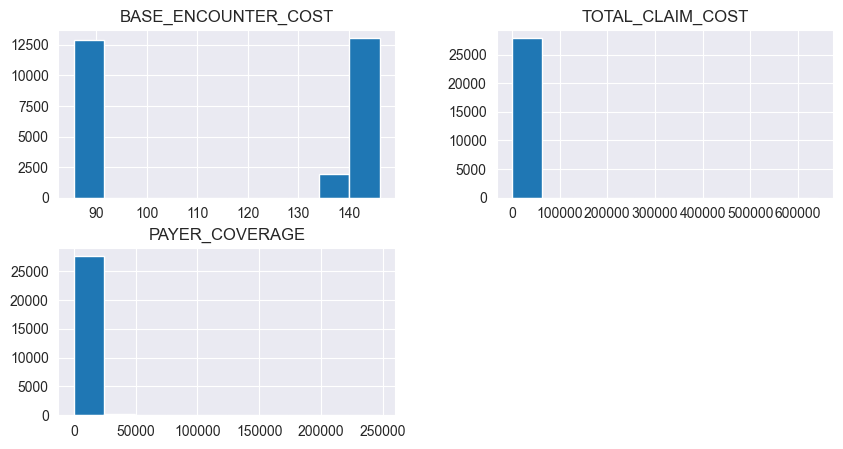
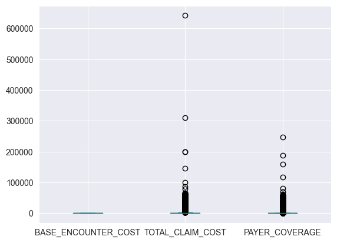
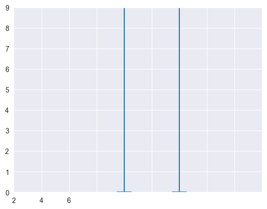
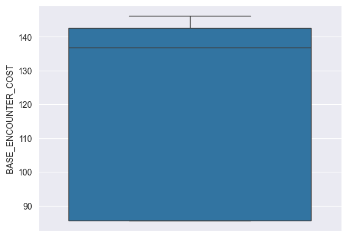
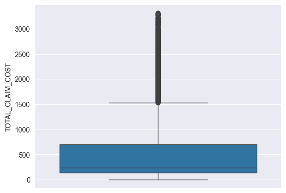
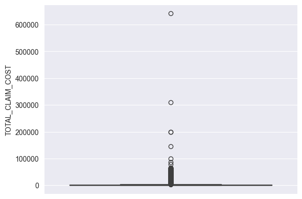
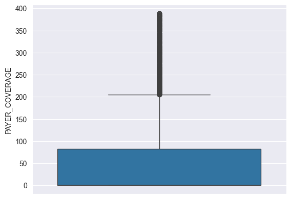
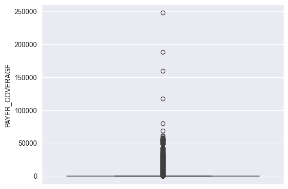
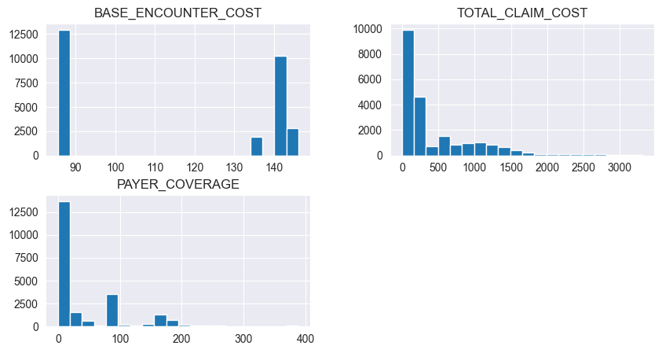

```python
import pandas as pd
import numpy as np
import matplotlib.pyplot as plt
import seaborn as sns
```


```python
#Read the data to get a view
df = pd.read_csv('/Users/.../Power bi project /Hospital records/encounters.csv')
df.head()
```


<div>
<style scoped>
    .dataframe tbody tr th:only-of-type {
        vertical-align: middle;
    }

    .dataframe tbody tr th {
        vertical-align: top;
    }

    .dataframe thead th {
        text-align: right;
    }
</style>
<table border="1" class="dataframe">
  <thead>
    <tr style="text-align: right;">
      <th></th>
      <th>Id</th>
      <th>START</th>
      <th>STOP</th>
      <th>PATIENT</th>
      <th>ORGANIZATION</th>
      <th>PAYER</th>
      <th>ENCOUNTERCLASS</th>
      <th>CODE</th>
      <th>DESCRIPTION</th>
      <th>BASE_ENCOUNTER_COST</th>
      <th>TOTAL_CLAIM_COST</th>
      <th>PAYER_COVERAGE</th>
      <th>REASONCODE</th>
      <th>REASONDESCRIPTION</th>
    </tr>
  </thead>
  <tbody>
    <tr>
      <th>0</th>
      <td>32c84703-2481-49cd-d571-3899d5820253</td>
      <td>2011-01-02T09:26:36Z</td>
      <td>2011-01-02T12:58:36Z</td>
      <td>3de74169-7f67-9304-91d4-757e0f3a14d2</td>
      <td>d78e84ec-30aa-3bba-a33a-f29a3a454662</td>
      <td>b1c428d6-4f07-31e0-90f0-68ffa6ff8c76</td>
      <td>ambulatory</td>
      <td>185347001</td>
      <td>Encounter for problem (procedure)</td>
      <td>85.55</td>
      <td>1018.02</td>
      <td>0.00</td>
      <td>NaN</td>
      <td>NaN</td>
    </tr>
    <tr>
      <th>1</th>
      <td>c98059da-320a-c0a6-fced-c8815f3e3f39</td>
      <td>2011-01-03T05:44:39Z</td>
      <td>2011-01-03T06:01:42Z</td>
      <td>d9ec2e44-32e9-9148-179a-1653348cc4e2</td>
      <td>d78e84ec-30aa-3bba-a33a-f29a3a454662</td>
      <td>b1c428d6-4f07-31e0-90f0-68ffa6ff8c76</td>
      <td>outpatient</td>
      <td>308335008</td>
      <td>Patient encounter procedure</td>
      <td>142.58</td>
      <td>2619.36</td>
      <td>0.00</td>
      <td>NaN</td>
      <td>NaN</td>
    </tr>
    <tr>
      <th>2</th>
      <td>4ad28a3a-2479-782b-f29c-d5b3f41a001e</td>
      <td>2011-01-03T14:32:11Z</td>
      <td>2011-01-03T14:47:11Z</td>
      <td>73babadf-5b2b-fee7-189e-6f41ff213e01</td>
      <td>d78e84ec-30aa-3bba-a33a-f29a3a454662</td>
      <td>7caa7254-5050-3b5e-9eae-bd5ea30e809c</td>
      <td>outpatient</td>
      <td>185349003</td>
      <td>Encounter for check up (procedure)</td>
      <td>85.55</td>
      <td>461.59</td>
      <td>305.27</td>
      <td>NaN</td>
      <td>NaN</td>
    </tr>
    <tr>
      <th>3</th>
      <td>c3f4da61-e4b4-21d5-587a-fbc89943bc19</td>
      <td>2011-01-03T16:24:45Z</td>
      <td>2011-01-03T16:39:45Z</td>
      <td>3b46a0b7-0f34-9b9a-c319-ace4a1f58c0b</td>
      <td>d78e84ec-30aa-3bba-a33a-f29a3a454662</td>
      <td>b1c428d6-4f07-31e0-90f0-68ffa6ff8c76</td>
      <td>wellness</td>
      <td>162673000</td>
      <td>General examination of patient (procedure)</td>
      <td>136.80</td>
      <td>1784.24</td>
      <td>0.00</td>
      <td>NaN</td>
      <td>NaN</td>
    </tr>
    <tr>
      <th>4</th>
      <td>a9183b4f-2572-72ea-54c2-b3cd038b4be7</td>
      <td>2011-01-03T17:36:53Z</td>
      <td>2011-01-03T17:51:53Z</td>
      <td>fa006887-d93c-d302-8b89-f3c25f88c0e1</td>
      <td>d78e84ec-30aa-3bba-a33a-f29a3a454662</td>
      <td>42c4fca7-f8a9-3cd1-982a-dd9751bf3e2a</td>
      <td>ambulatory</td>
      <td>390906007</td>
      <td>Follow-up encounter</td>
      <td>85.55</td>
      <td>234.72</td>
      <td>0.00</td>
      <td>55822004.0</td>
      <td>Hyperlipidemia</td>
    </tr>
  </tbody>
</table>
</div>


```python
#Remove all the column you don't want
df = df.drop(labels =
             ['PATIENT',
             'ORGANIZATION',
             'PAYER',
             'CODE',
             'REASONCODE'],
             axis=1)

print(df.head())

```

                                         Id                 START  \
    0  32c84703-2481-49cd-d571-3899d5820253  2011-01-02T09:26:36Z   
    1  c98059da-320a-c0a6-fced-c8815f3e3f39  2011-01-03T05:44:39Z   
    2  4ad28a3a-2479-782b-f29c-d5b3f41a001e  2011-01-03T14:32:11Z   
    3  c3f4da61-e4b4-21d5-587a-fbc89943bc19  2011-01-03T16:24:45Z   
    4  a9183b4f-2572-72ea-54c2-b3cd038b4be7  2011-01-03T17:36:53Z   
    
                       STOP ENCOUNTERCLASS  \
    0  2011-01-02T12:58:36Z     ambulatory   
    1  2011-01-03T06:01:42Z     outpatient   
    2  2011-01-03T14:47:11Z     outpatient   
    3  2011-01-03T16:39:45Z       wellness   
    4  2011-01-03T17:51:53Z     ambulatory   
    
                                      DESCRIPTION  BASE_ENCOUNTER_COST  \
    0           Encounter for problem (procedure)                85.55   
    1                 Patient encounter procedure               142.58   
    2          Encounter for check up (procedure)                85.55   
    3  General examination of patient (procedure)               136.80   
    4                         Follow-up encounter                85.55   
    
       TOTAL_CLAIM_COST  PAYER_COVERAGE REASONDESCRIPTION  
    0           1018.02            0.00               NaN  
    1           2619.36            0.00               NaN  
    2            461.59          305.27               NaN  
    3           1784.24            0.00               NaN  
    4            234.72            0.00    Hyperlipidemia  


```python
#Remove missing data and do general cleaning
df.info()
#No missing data was observed in this file

#Number5, 6, and 7 the type of the data neads to change
```

    <class 'pandas.core.frame.DataFrame'>
    RangeIndex: 27891 entries, 0 to 27890
    Data columns (total 9 columns):
     #   Column               Non-Null Count  Dtype  
    ---  ------               --------------  -----  
     0   Id                   27891 non-null  object 
     1   START                27891 non-null  object 
     2   STOP                 27891 non-null  object 
     3   ENCOUNTERCLASS       27891 non-null  object 
     4   DESCRIPTION          27891 non-null  object 
     5   BASE_ENCOUNTER_COST  27891 non-null  float64
     6   TOTAL_CLAIM_COST     27891 non-null  float64
     7   PAYER_COVERAGE       27891 non-null  float64
     8   REASONDESCRIPTION    8350 non-null   object 
    dtypes: float64(3), object(6)
    memory usage: 1.9+ MB


```python
#Data analysis
#Change the data type
money_wise = ['BASE_ENCOUNTER_COST', 'TOTAL_CLAIM_COST', 'PAYER_COVERAGE']
#df['money_wise'] = df['money_wise'].apply(lambda x: x.str.strip().str.replace(',', ' '))
#df['money_wise'] = df['money_wise'].apply(pd.to_numeric, errors='coerce')
"""""
df['BASE_ENCOUNTER_COST'] = df['BASE_ENCOUNTER_COST'].astype(float)
df['TOTAL_CLAIM_COST'] = df['TOTAL_CLAIM_COST'].astype(float)
df['PAYER_COVERAGE'] = df['PAYER_COVERAGE'].astype(float)
"""""
#NA data
df['BASE_ENCOUNTER_COST'].isnull


```


    <bound method Series.isnull of 0         85.55
    1        142.58
    2         85.55
    3        136.80
    4         85.55
              ...  
    27886     85.55
    27887    142.58
    27888    142.58
    27889    136.80
    27890    136.80
    Name: BASE_ENCOUNTER_COST, Length: 27891, dtype: float64>


```python
df['TOTAL_CLAIM_COST'].isnull
```


    <bound method Series.isnull of 0         1018.02
    1         2619.36
    2          461.59
    3         1784.24
    4          234.72
               ...   
    27886       85.55
    27887    10588.34
    27888    11984.29
    27889      408.80
    27890        0.00
    Name: TOTAL_CLAIM_COST, Length: 27891, dtype: float64>


```python
df['PAYER_COVERAGE'].isnull
```


    <bound method Series.isnull of 0           0.00
    1           0.00
    2         305.27
    3           0.00
    4           0.00
              ...   
    27886      24.27
    27887    8438.67
    27888       0.00
    27889       0.00
    27890       0.00
    Name: PAYER_COVERAGE, Length: 27891, dtype: float64>


```python
#The mean. median, and the other thing for the costs of the procedures done
#money_wise = ['BASE_ENCOUNTER_COST', 'TOTAL_CLAIM_COST', 'PAYER_COVERAGE']

#BASE_ENCOUNTER_COST
df[['BASE_ENCOUNTER_COST', 'TOTAL_CLAIM_COST', 'PAYER_COVERAGE']].agg(['mean', 'median', 'std'])
```


<div>
<style scoped>
    .dataframe tbody tr th:only-of-type {
        vertical-align: middle;
    }

    .dataframe tbody tr th {
        vertical-align: top;
    }

    .dataframe thead th {
        text-align: right;
    }
</style>
<table border="1" class="dataframe">
  <thead>
    <tr style="text-align: right;">
      <th></th>
      <th>BASE_ENCOUNTER_COST</th>
      <th>TOTAL_CLAIM_COST</th>
      <th>PAYER_COVERAGE</th>
    </tr>
  </thead>
  <tbody>
    <tr>
      <th>mean</th>
      <td>116.181614</td>
      <td>3639.682174</td>
      <td>1114.965652</td>
    </tr>
    <tr>
      <th>median</th>
      <td>136.800000</td>
      <td>278.580000</td>
      <td>28.440000</td>
    </tr>
    <tr>
      <th>std</th>
      <td>28.410082</td>
      <td>9205.595748</td>
      <td>4768.615576</td>
    </tr>
  </tbody>
</table>
</div>


```python
# make data
df[['BASE_ENCOUNTER_COST', 'TOTAL_CLAIM_COST', 'PAYER_COVERAGE']].hist(bins=10, figsize=(10,5))
plt.show()

#Add mean, median, and std for the graphs. and try to fix the distrebution


#another plot
df[['BASE_ENCOUNTER_COST', 'TOTAL_CLAIM_COST', 'PAYER_COVERAGE']].plot(kind = 'box')
plt.show()


```


    

    


    

    


```python
#There's outliers try to find them
# plot
fig, ax = plt.subplots()
VP = ax.boxplot(df[['BASE_ENCOUNTER_COST', 'TOTAL_CLAIM_COST', 'TOTAL_CLAIM_COST']], positions=[2, 4, 6], widths=1, patch_artist=True,
                showmeans=False, showfliers=False,
                medianprops={"color": "white", "linewidth": 0.5},
                boxprops={"facecolor": "C0", "edgecolor": "white",
                          "linewidth": 0.5},
                whiskerprops={"color": "C0", "linewidth": 1.5},
                capprops={"color": "C0", "linewidth": 1.5})

ax.set(xlim=(0, 8), xticks=np.arange(0, 10),
       ylim=(0, 8), yticks=np.arange(0, 10))

plt.show()
```


    

    


```python
#A functional way to get the values with detils
df.describe()
```


<div>
<style scoped>
    .dataframe tbody tr th:only-of-type {
        vertical-align: middle;
    }

    .dataframe tbody tr th {
        vertical-align: top;
    }

    .dataframe thead th {
        text-align: right;
    }
</style>
<table border="1" class="dataframe">
  <thead>
    <tr style="text-align: right;">
      <th></th>
      <th>BASE_ENCOUNTER_COST</th>
      <th>TOTAL_CLAIM_COST</th>
      <th>PAYER_COVERAGE</th>
    </tr>
  </thead>
  <tbody>
    <tr>
      <th>count</th>
      <td>27891.000000</td>
      <td>27891.000000</td>
      <td>27891.000000</td>
    </tr>
    <tr>
      <th>mean</th>
      <td>116.181614</td>
      <td>3639.682174</td>
      <td>1114.965652</td>
    </tr>
    <tr>
      <th>std</th>
      <td>28.410082</td>
      <td>9205.595748</td>
      <td>4768.615576</td>
    </tr>
    <tr>
      <th>min</th>
      <td>85.550000</td>
      <td>0.000000</td>
      <td>0.000000</td>
    </tr>
    <tr>
      <th>25%</th>
      <td>85.550000</td>
      <td>142.580000</td>
      <td>0.000000</td>
    </tr>
    <tr>
      <th>50%</th>
      <td>136.800000</td>
      <td>278.580000</td>
      <td>28.440000</td>
    </tr>
    <tr>
      <th>75%</th>
      <td>142.580000</td>
      <td>1412.530000</td>
      <td>155.770000</td>
    </tr>
    <tr>
      <th>max</th>
      <td>146.180000</td>
      <td>641882.700000</td>
      <td>247751.420000</td>
    </tr>
  </tbody>
</table>
</div>


```python
#Removing outliers using the IQR
Q1 = df[['BASE_ENCOUNTER_COST', 'TOTAL_CLAIM_COST', 'PAYER_COVERAGE']].quantile(0.25)
Q3 = df[['BASE_ENCOUNTER_COST', 'TOTAL_CLAIM_COST', 'PAYER_COVERAGE']].quantile(0.75)
Q1, Q3
```


    (BASE_ENCOUNTER_COST     85.55
     TOTAL_CLAIM_COST       142.58
     PAYER_COVERAGE           0.00
     Name: 0.25, dtype: float64,
     BASE_ENCOUNTER_COST     142.58
     TOTAL_CLAIM_COST       1412.53
     PAYER_COVERAGE          155.77
     Name: 0.75, dtype: float64)


```python
IQR = Q3 - Q1
IQR
```


    BASE_ENCOUNTER_COST      57.03
    TOTAL_CLAIM_COST       1269.95
    PAYER_COVERAGE          155.77
    dtype: float64


```python
lower_limit = Q1 - 1.5*IQR
upper_limit = Q3 + 1.5*IQR
lower_limit, upper_limit

```


    (BASE_ENCOUNTER_COST       0.005
     TOTAL_CLAIM_COST      -1762.345
     PAYER_COVERAGE         -233.655
     dtype: float64,
     BASE_ENCOUNTER_COST     228.125
     TOTAL_CLAIM_COST       3317.455
     PAYER_COVERAGE          389.425
     dtype: float64)


```python
#Getting the outliers from the results that we did above
df[((df[money_wise] < lower_limit) | (df[money_wise] > upper_limit)).any(axis=1)]

```


<div>
<style scoped>
    .dataframe tbody tr th:only-of-type {
        vertical-align: middle;
    }

    .dataframe tbody tr th {
        vertical-align: top;
    }

    .dataframe thead th {
        text-align: right;
    }
</style>
<table border="1" class="dataframe">
  <thead>
    <tr style="text-align: right;">
      <th></th>
      <th>Id</th>
      <th>START</th>
      <th>STOP</th>
      <th>ENCOUNTERCLASS</th>
      <th>DESCRIPTION</th>
      <th>BASE_ENCOUNTER_COST</th>
      <th>TOTAL_CLAIM_COST</th>
      <th>PAYER_COVERAGE</th>
      <th>REASONDESCRIPTION</th>
    </tr>
  </thead>
  <tbody>
    <tr>
      <th>5</th>
      <td>c4923a74-3e40-8b0c-cf73-05b9c0390621</td>
      <td>2011-01-03T19:08:16Z</td>
      <td>2011-01-03T19:23:16Z</td>
      <td>wellness</td>
      <td>General examination of patient (procedure)</td>
      <td>136.80</td>
      <td>1183.25</td>
      <td>946.58</td>
      <td>NaN</td>
    </tr>
    <tr>
      <th>6</th>
      <td>c140ed81-040e-8319-e860-f72b4738ed22</td>
      <td>2011-01-03T22:39:50Z</td>
      <td>2011-01-03T22:54:50Z</td>
      <td>outpatient</td>
      <td>Encounter for check up (procedure)</td>
      <td>85.55</td>
      <td>6024.77</td>
      <td>0.00</td>
      <td>NaN</td>
    </tr>
    <tr>
      <th>7</th>
      <td>2cfd4ddd-ad13-fe1e-528b-15051cea2ec3</td>
      <td>2011-01-04T14:49:55Z</td>
      <td>2011-01-04T15:04:55Z</td>
      <td>ambulatory</td>
      <td>Encounter for problem</td>
      <td>85.55</td>
      <td>11855.19</td>
      <td>11205.43</td>
      <td>Malignant tumor of colon</td>
    </tr>
    <tr>
      <th>9</th>
      <td>17966936-0878-f4db-128b-a43ae10d0878</td>
      <td>2011-01-05T04:02:09Z</td>
      <td>2011-01-05T04:17:09Z</td>
      <td>outpatient</td>
      <td>Encounter for problem</td>
      <td>85.55</td>
      <td>9881.17</td>
      <td>7872.94</td>
      <td>Non-small cell lung cancer (disorder)</td>
    </tr>
    <tr>
      <th>11</th>
      <td>97c951a3-4fce-fc9a-556f-f3c14677fec9</td>
      <td>2011-01-05T19:37:58Z</td>
      <td>2011-01-05T19:52:58Z</td>
      <td>wellness</td>
      <td>General examination of patient (procedure)</td>
      <td>136.80</td>
      <td>1576.46</td>
      <td>1497.64</td>
      <td>NaN</td>
    </tr>
    <tr>
      <th>...</th>
      <td>...</td>
      <td>...</td>
      <td>...</td>
      <td>...</td>
      <td>...</td>
      <td>...</td>
      <td>...</td>
      <td>...</td>
      <td>...</td>
    </tr>
    <tr>
      <th>27881</th>
      <td>93cfd731-2064-3346-8c93-2d0f442a0e9b</td>
      <td>2022-01-28T07:13:29Z</td>
      <td>2022-01-28T07:28:29Z</td>
      <td>outpatient</td>
      <td>Encounter for check up (procedure)</td>
      <td>85.55</td>
      <td>8111.24</td>
      <td>6337.18</td>
      <td>NaN</td>
    </tr>
    <tr>
      <th>27882</th>
      <td>cbc4aa02-ff77-81e6-e181-c49607258ad6</td>
      <td>2022-01-28T13:12:16Z</td>
      <td>2022-01-28T13:27:16Z</td>
      <td>wellness</td>
      <td>General examination of patient (procedure)</td>
      <td>136.80</td>
      <td>25399.37</td>
      <td>20235.27</td>
      <td>NaN</td>
    </tr>
    <tr>
      <th>27883</th>
      <td>88a7d669-3b67-1ac4-d9f6-10b1e369dd69</td>
      <td>2022-01-28T20:01:36Z</td>
      <td>2022-01-28T23:54:36Z</td>
      <td>ambulatory</td>
      <td>Encounter for problem (procedure)</td>
      <td>85.55</td>
      <td>955.02</td>
      <td>708.42</td>
      <td>NaN</td>
    </tr>
    <tr>
      <th>27887</th>
      <td>07710480-9d6b-9c9b-87c3-c1d54df4069d</td>
      <td>2022-01-29T20:12:53Z</td>
      <td>2022-01-29T20:27:53Z</td>
      <td>urgentcare</td>
      <td>Urgent care clinic (procedure)</td>
      <td>142.58</td>
      <td>10588.34</td>
      <td>8438.67</td>
      <td>NaN</td>
    </tr>
    <tr>
      <th>27888</th>
      <td>01b57f06-cebe-a3e4-4423-a796ffb0c35d</td>
      <td>2022-01-29T20:35:37Z</td>
      <td>2022-01-29T20:50:37Z</td>
      <td>ambulatory</td>
      <td>Prenatal visit</td>
      <td>142.58</td>
      <td>11984.29</td>
      <td>0.00</td>
      <td>Normal pregnancy</td>
    </tr>
  </tbody>
</table>
<p>8335 rows × 9 columns</p>
</div>


```python
#Now that we found the outliers, you can remove them from the table
df_without_outliers = df[
    ((df[money_wise] > lower_limit)&(df[money_wise] < upper_limit))]
df_without_outliers

#you can see in the table some nan values (make sure you remove them and make another tabel that include the 3 main steps
```


<div>
<style scoped>
    .dataframe tbody tr th:only-of-type {
        vertical-align: middle;
    }

    .dataframe tbody tr th {
        vertical-align: top;
    }

    .dataframe thead th {
        text-align: right;
    }
</style>
<table border="1" class="dataframe">
  <thead>
    <tr style="text-align: right;">
      <th></th>
      <th>Id</th>
      <th>START</th>
      <th>STOP</th>
      <th>ENCOUNTERCLASS</th>
      <th>DESCRIPTION</th>
      <th>BASE_ENCOUNTER_COST</th>
      <th>TOTAL_CLAIM_COST</th>
      <th>PAYER_COVERAGE</th>
      <th>REASONDESCRIPTION</th>
    </tr>
  </thead>
  <tbody>
    <tr>
      <th>0</th>
      <td>NaN</td>
      <td>NaN</td>
      <td>NaN</td>
      <td>NaN</td>
      <td>NaN</td>
      <td>85.55</td>
      <td>1018.02</td>
      <td>0.00</td>
      <td>NaN</td>
    </tr>
    <tr>
      <th>1</th>
      <td>NaN</td>
      <td>NaN</td>
      <td>NaN</td>
      <td>NaN</td>
      <td>NaN</td>
      <td>142.58</td>
      <td>2619.36</td>
      <td>0.00</td>
      <td>NaN</td>
    </tr>
    <tr>
      <th>2</th>
      <td>NaN</td>
      <td>NaN</td>
      <td>NaN</td>
      <td>NaN</td>
      <td>NaN</td>
      <td>85.55</td>
      <td>461.59</td>
      <td>305.27</td>
      <td>NaN</td>
    </tr>
    <tr>
      <th>3</th>
      <td>NaN</td>
      <td>NaN</td>
      <td>NaN</td>
      <td>NaN</td>
      <td>NaN</td>
      <td>136.80</td>
      <td>1784.24</td>
      <td>0.00</td>
      <td>NaN</td>
    </tr>
    <tr>
      <th>4</th>
      <td>NaN</td>
      <td>NaN</td>
      <td>NaN</td>
      <td>NaN</td>
      <td>NaN</td>
      <td>85.55</td>
      <td>234.72</td>
      <td>0.00</td>
      <td>NaN</td>
    </tr>
    <tr>
      <th>...</th>
      <td>...</td>
      <td>...</td>
      <td>...</td>
      <td>...</td>
      <td>...</td>
      <td>...</td>
      <td>...</td>
      <td>...</td>
      <td>...</td>
    </tr>
    <tr>
      <th>27886</th>
      <td>NaN</td>
      <td>NaN</td>
      <td>NaN</td>
      <td>NaN</td>
      <td>NaN</td>
      <td>85.55</td>
      <td>85.55</td>
      <td>24.27</td>
      <td>NaN</td>
    </tr>
    <tr>
      <th>27887</th>
      <td>NaN</td>
      <td>NaN</td>
      <td>NaN</td>
      <td>NaN</td>
      <td>NaN</td>
      <td>142.58</td>
      <td>NaN</td>
      <td>NaN</td>
      <td>NaN</td>
    </tr>
    <tr>
      <th>27888</th>
      <td>NaN</td>
      <td>NaN</td>
      <td>NaN</td>
      <td>NaN</td>
      <td>NaN</td>
      <td>142.58</td>
      <td>NaN</td>
      <td>0.00</td>
      <td>NaN</td>
    </tr>
    <tr>
      <th>27889</th>
      <td>NaN</td>
      <td>NaN</td>
      <td>NaN</td>
      <td>NaN</td>
      <td>NaN</td>
      <td>136.80</td>
      <td>408.80</td>
      <td>0.00</td>
      <td>NaN</td>
    </tr>
    <tr>
      <th>27890</th>
      <td>NaN</td>
      <td>NaN</td>
      <td>NaN</td>
      <td>NaN</td>
      <td>NaN</td>
      <td>136.80</td>
      <td>0.00</td>
      <td>0.00</td>
      <td>NaN</td>
    </tr>
  </tbody>
</table>
<p>27891 rows × 9 columns</p>
</div>


```python
#In this make another box plot to make SURE no outliers are effecting the graph
#There's outliers try to find them
#plot
sns.boxplot(df_without_outliers['BASE_ENCOUNTER_COST'])

```


    <Axes: ylabel='BASE_ENCOUNTER_COST'>


    

    


```python
#With outliers
sns.boxplot(df['BASE_ENCOUNTER_COST'])
```


    <Axes: ylabel='BASE_ENCOUNTER_COST'>


    

    


```python
sns.boxplot(df_without_outliers['TOTAL_CLAIM_COST'])
```


    <Axes: ylabel='TOTAL_CLAIM_COST'>


    

    


```python
#With outliers
sns.boxplot(df['TOTAL_CLAIM_COST'])

```


    <Axes: ylabel='TOTAL_CLAIM_COST'>


    

    


```python
sns.boxplot(df_without_outliers['PAYER_COVERAGE'])
```


    <Axes: ylabel='PAYER_COVERAGE'>


    

    


```python
#With outliers
sns.boxplot(df['PAYER_COVERAGE'])
```


    <Axes: ylabel='PAYER_COVERAGE'>


    

    


```python
# make data
df_without_outliers[['BASE_ENCOUNTER_COST', 'TOTAL_CLAIM_COST', 'PAYER_COVERAGE']].hist(bins=20, figsize=(10,5))
plt.show()
```


    

    

